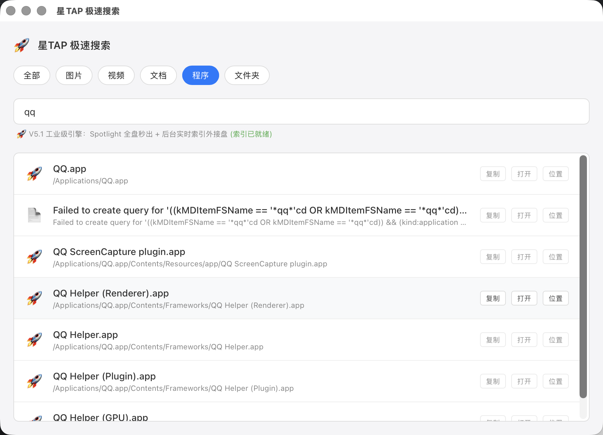

# ⚡️ 星TAP | 极速搜索 (Fast Search)

> **堪比 Everything 的 Mac 极速文件搜索神器。毫秒级响应，告别 Spotlight 的迟钝。**

[中文介绍](#-为什么需要它) | [English Introduction](#-english-introduction)

---

## 🌟 为什么需要它？

在 Windows 上我们有 Everything，但在 Mac 上，系统自带的 Spotlight 经常搜不到文件，或者索引缓慢。
**星TAP | 极速搜索** 是专门为追求极致速度的用户打造的：
- 🚀 **毫秒级搜索**：Spotlight + 内存索引双引擎并行，输入即显示，真正的零延迟。
- 🔍 **全盘扫描**：自动索引你的桌面、下载、文档、应用程序，甚至包括**外接硬盘**和 **U盘**。
- 📝 **内容搜索**：基于 ripgrep (rg) 的文件内容搜索，代码/文档中的关键词一搜即达。
- 🧠 **智能排序**：自动记录你的点击习惯，越常用的文件排得越靠前。
- 💻 **极简操作**：按下快捷键，输入关键词，直接回车打开。
- 🖥️ **CLI 支持**：独立命令行工具 `sts`，终端用户和 AI 脚本也能极速搜索。

## 📸 界面预览




### ✨ 它能解决什么问题？
- **Spotlight 搜不到？** 我们直接调用底层索引 + fd 加速，哪怕是隐藏文件夹里的东西也能翻出来。
- **外接盘搜索慢？** 自动监控 `/Volumes` 变化，插上 U盘即刻完成索引。
- **文件太多记不住？** 模糊搜索 + 拼音缩写 + 中文俗称，只要记得文件名的一部分就能找到。
- **想搜文件内容？** rg 引擎全文搜索，支持正则表达式、文件类型过滤。
- **免费且纯净**：完全本地运行，不联网，不占内存，这就是你要的 Everything Mac 版。

---

## 🛠 快速上手 (Quick Start)

> **🎉 点击前往下载：[最新版星TAP极速搜索 (.dmg)](https://github.com/cscb603/fast-search/releases/latest)**

1. 下载并解压，将 `星TAP 极速搜索.app` 拖入你的**应用程序**文件夹，或直接安装 `.dmg` 文件。
2. 首次启动时，它会自动在后台扫描文件建立索引（通常只需几秒钟）。
3. **快捷键**：`Command + Shift + F` 呼出/隐藏搜索窗口。

---

## ✨ 版本历史

### v2.2.0 (2026.04) — 极速引擎稳定版

- 🦀 **依赖全面升级**：Tauri 2.10.x + 所有插件最新版
- 📝 **内容搜索**：新增 🔍内容 标签页，基于 ripgrep (rg) 全文搜索，带行号和关键词高亮
- ⚡ **fd/rg 极客加速**：索引构建自动使用 fd，内容搜索自动使用 rg，不可用时回退 find/grep
- 🖥️ **独立 CLI 工具** (`sts`)：终端搜索不再依赖 GUI，支持 JSON 输出
- 🏗️ **架构重构**：核心搜索引擎 (core.rs) 与 Tauri 完全解耦，可被 CLI / AI / Skill 独立调用
- 🐛 **零编译警告**：全面修复所有 warning

### v1.0.0 (2026.02) — 工业级版

- 🦀 **Rust + Tauri 2.0 重构**：底座全面升级，性能更稳健，兼容性更强。
- 🎨 **品牌视觉同步**：接入星TAP实验室统一视觉标准，图标更精致。
- 🛠️ **工业级工作流**：通过星TAP实验室 Master Workflow 重新编译，优化了二进制体积与启动速度。
- 🛡️ **安全增强**：完全本地运行，所有索引数据加密存储。

---

## 🖥️ CLI 工具 (sts)

极速搜索附带独立命令行工具 `sts`，无需启动 GUI 即可搜索：

```bash
# 文件名搜索
sts search "关键词"              # 搜索文件名
sts search "ps" -t app           # 搜索 Photoshop 程序
sts search "简历" -t doc -n 5    # 搜索文档，限制 5 条

# 内容搜索 (ripgrep)
sts content "TODO"               # 搜索文件内容
sts content "fn main" --path ~/project  # 指定路径
sts content "TODO" --json        # JSON 格式输出

# 索引管理
sts index                        # 构建/更新索引
sts index --status               # 查看索引状态
sts index --force                # 强制重建索引

# 列出索引文件
sts list -n 20                   # 显示前 20 条
sts list --filter ".rs"          # 过滤 Rust 文件
```

### 安装 CLI

```bash
# 编译后自动安装
cp target/release/sts ~/.local/bin/sts
```

---

## 🤓 技术细节 (For Techies)

本项目基于 **Tauri 2.0 + Rust** 开发，追求极致的系统性能与内存安全。

### 架构

```
┌─────────────────────────────────────────────┐
│           前端 (vanilla JS)                   │
│   index.html + main.js + styles.css         │
└──────────────┬──────────────────────────────┘
               │ Tauri IPC
┌──────────────▼──────────────────────────────┐
│         lib.rs (Tauri 桥接层)                 │
│   search_files / search_content_command      │
│   open_file / copy_to_clipboard / ...        │
└──────────────┬──────────────────────────────┘
               │ 调用 core 模块
┌──────────────▼──────────────────────────────┐
│        core.rs (核心搜索引擎)                  │
│   - search_files(): Spotlight + 内存索引并行   │
│   - search_content(): rg/grep 内容搜索        │
│   - GlobalIndex: 索引构建/缓存/后台更新        │
│   - 智能排序: 点击频次 + 匹配度 + 位置权重      │
│   - 别名映射: 拼音缩写 + 中文俗称 + 动态扫描     │
└─────────────────────────────────────────────┘

┌─────────────────────────────────────────────┐
│        sts.rs (独立 CLI binary)               │
│   同样调用 core 模块，不依赖 Tauri              │
└─────────────────────────────────────────────┘
```

### 关键技术
- **双引擎搜索**：Spotlight (mdfind) + 内存索引并行搜索，合并去重
- **fd/rg 加速**：自动检测 fd/rg，不可用时回退 find/grep
- **索引持久化**：索引缓存存储在 `~/Library/Caches/com.xtap.search/`，重启秒开
- **动态监听**：后台线程每 30 秒轮询 `/Volumes` 状态，实时更新移动存储索引
- **智能排序**：点击频次权重 + 连续匹配加分 + 别名/缩写匹配加分 + 路径位置权重
- **别名映射**：支持中文俗称 (wx→微信)、拼音缩写 (ps→Photoshop)、动态扫描 /Applications

### 依赖版本

| 依赖 | 版本 | 用途 |
|------|------|------|
| tauri | 2.10.x | 桌面应用框架 |
| tauri-plugin-* | 2.x | 打开文件/剪贴板/Shell/全局快捷键/CLI |
| regex | 1.12.x | 正则匹配 |
| dirs | 6.0 | 系统目录路径 |
| serde / serde_json | 1.0 | 序列化 |
| tokio | 1.49.x | 异步运行时 |
| clap | 4.5.x | CLI 参数解析 |

---

## English Introduction

### ⚡️ Why this project?
Frustrated with the slow or incomplete indexing of macOS Spotlight? **Fast Search** brings the "Everything-like" experience to Mac. Built with **Rust and Tauri**, it offers millisecond-level search results with zero latency.

### ✨ Key Features
- **Instant Search**: Type and find results immediately with dual-engine (Spotlight + in-memory index).
- **Content Search**: Full-text search powered by ripgrep with line numbers and keyword highlighting.
- **CLI Tool**: Independent `sts` command-line tool for terminal users and AI integration.
- **External Drive Support**: Automatically indexes USB drives and external SSDs.
- **Smart Ranking**: Your most-used files move to the top automatically.
- **Alias Mapping**: Search by Chinese names (微信), pinyin initials (wx), or English names (WeChat).
- **Privacy Focused**: Works entirely offline. No data ever leaves your computer.

---

## 开源协议 (License)
MIT License
